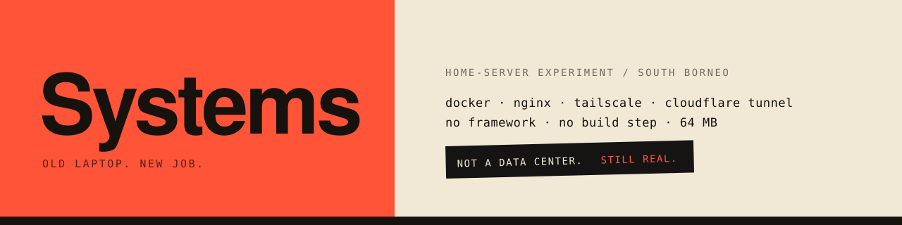
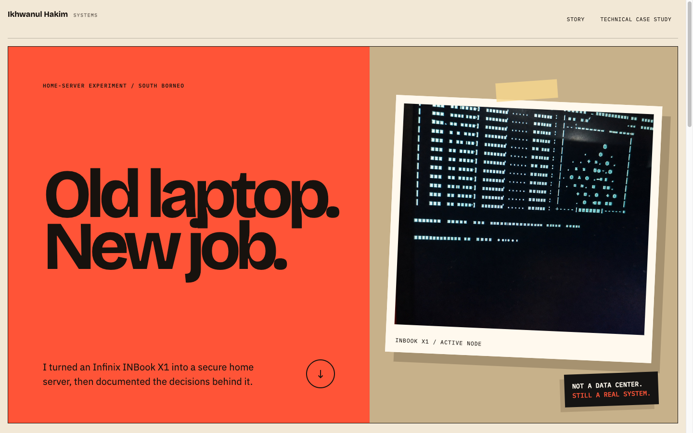
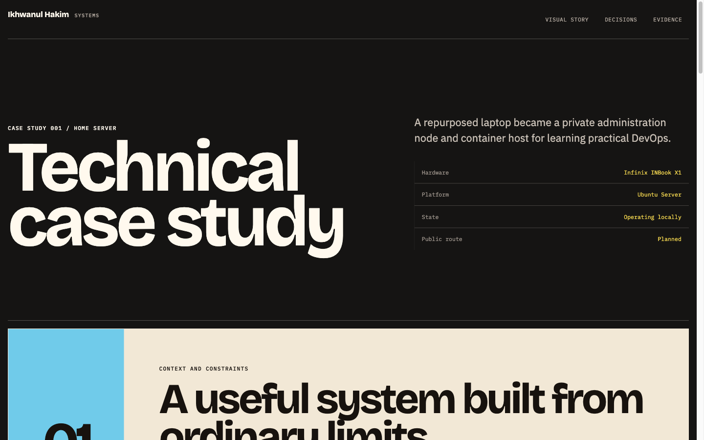
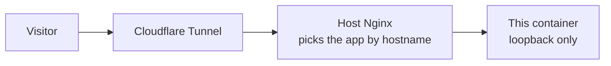

<picture>
  <source media="(prefers-color-scheme: dark)" srcset="docs/banner-dark.svg">
  
</picture>


A static site about turning an old budget laptop into a home server that runs real services, and about the decisions behind it.

It will live at `systems.ikhwanulhakim.com`, served from the laptop it describes. Publishing is the step I am on now, so the address does not answer yet.



## Why it exists

I wanted to learn server operations properly. Reading about SSH keys, firewalls, reverse proxies, and containers teaches you the words. Keeping a machine running teaches you the trade-offs.

This site is the write-up. It has two pages, because two very different people open it.

| Route | Reader | What they get |
|---|---|---|
| `/systems/` | Anyone, including non-engineers | A thirty second visual story: the problem, three practical answers, and what actually runs |
| `/systems/case-study/` | Engineers and interviewers | Architecture, decisions with reasons, operational evidence, lessons, and planned work |

Splitting them was the main content decision. A recruiter should not have to scroll past a container configuration to understand the project, and an engineer should not have to guess at the details.



## Run it

```bash
git clone https://github.com/ikhwanulhakim-code/home-server-systems.git
cd home-server-systems
python3 -m http.server 4173 --bind 127.0.0.1 --directory public
```

Open `http://127.0.0.1:4173/systems/`.

To run the real serving setup instead of a plain file server:

```bash
docker compose up -d
curl -H 'Host: systems.home.internal' http://127.0.0.1:8084/
```

## The constraints are the point

| Constraint | Reason |
|---|---|
| No framework, no build step, no bundler | The site is HTML, CSS, and 25 lines of JavaScript. Nothing to upgrade at two in the morning |
| Fonts served from this repository | The page loads nothing from a third party, so no outside service can slow it down or watch the visitor |
| Container capped at 64 MB and a quarter of a CPU | A static site needs no more, and the laptop has other work to do |
| Read only filesystem, `no-new-privileges`, loopback binding | A web server that cannot write and cannot be reached directly from the network is a small target |
| Works with JavaScript turned off | The scroll reveals are decoration. Disable them and every word is still there |
| `prefers-reduced-motion` honoured | Motion is optional for people who need it to be |

Verified at 360, 768, 1024, and 1440 CSS pixels, with WCAG AA contrast on text and controls and interactive targets of at least 44 by 44 pixels. Everything served is 616 KB, fonts and photographs included.

## Checks

```bash
./tests/smoke.sh            # content, required assets, palette, private data scan
./tests/container-smoke.sh  # running container, routes, loopback binding
```

Plain shell, no test framework, both finish in under a second. The container check asserts the things that are easy to get wrong: an unknown hostname returns 404, the deferred Build view is unreachable, and port 8084 listens on nothing but the loopback address.

<details>
<summary>Repository layout</summary>

```text
compose.yaml        Container definition
nginx/              Server configuration used inside the container
public/             Everything that is served
  systems/          Landing page and case study
  assets/           CSS, JavaScript, self-hosted fonts, images
tests/              Shell checks
tools/              Script that composes the social preview image
docs/               Banner and screenshots for this README
```

</details>

## How a visitor reaches the laptop



There is no port forwarding and no public IP. The tunnel dials outward from the server, so nothing at home has to accept an inbound connection. Administration uses a separate private path and never travels this one.

> [!NOTE]
> This repository is public on purpose and holds no infrastructure detail: no addresses, hardware identifiers, account names, private hostnames, credentials, or keys. `tests/smoke.sh` scans every file for those patterns and fails when one appears. The photograph carries no location or device metadata.

## Colour and type

Ink `#17120E`, Paper `#F2E8D6`, Signal Red `#FF5437`, Sky `#70CBEA`, Field Yellow `#F5D84F`, Night `#151413`. Bricolage Grotesque for display, IBM Plex Sans for body, IBM Plex Mono for labels. Solid colours only, no gradients and no glass panels.

## License

MIT, see [LICENSE](LICENSE). The photograph is mine. The fonts keep their own licenses, listed in [public/assets/fonts/LICENSES.md](public/assets/fonts/LICENSES.md).
