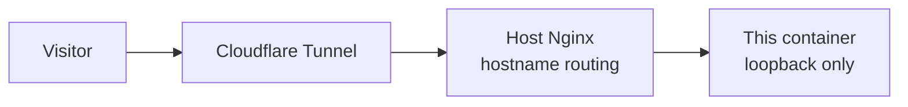

# Systems

A small static site about turning an old laptop into a home server that runs real services.

I built the server to learn operations properly rather than to collect tool names, and I built this site the same way: plain HTML, hand written CSS, and a few lines of JavaScript that the page works fine without.

Live at `systems.ikhwanulhakim.com`.

## The two pages

| Route | For whom |
|---|---|
| `/systems/` | Anyone. A short visual story: the problem, three practical answers, and what actually runs. |
| `/systems/case-study/` | Engineers and interviewers. Architecture, decisions with reasons, operational evidence, lessons, and planned work. |

Splitting them was the main content decision. A visitor should understand the project in thirty seconds without reading a single configuration excerpt, and a reader who wants depth should get it on a page of its own.

## Built with

- Semantic HTML with ordered headings and landmarks
- Modern CSS with custom properties, grid, and container friendly sizing
- Self hosted Bricolage Grotesque and IBM Plex, so the page loads no third party assets
- One small script for scroll reveals, disabled under `prefers-reduced-motion`
- Nginx in a hardened container for serving
- Shell scripts for the checks

No framework, no build step, no bundler. The whole site is a few hundred kilobytes.

## Run it locally

Any static file server works:

```bash
python3 -m http.server 4173 --bind 127.0.0.1 --directory public
```

Then open `http://127.0.0.1:4173/systems/`.

To run the real serving setup instead:

```bash
docker compose up -d
curl -H 'Host: systems.home.internal' http://127.0.0.1:8084/
```

The container publishes only the Systems view, binds to the loopback address, runs with a read only filesystem and `no-new-privileges`, and is capped at 64 MB of memory and a quarter of a CPU. A static site needs nothing more than that.

## Checks

```bash
./tests/smoke.sh            # content, required assets, palette, and privacy scan
./tests/container-smoke.sh  # the running container, routes, and loopback binding
```

Both are plain shell and take under a second. They run before anything is deployed.

The site is verified at 360, 768, 1024, and 1440 CSS pixels, keeps WCAG AA contrast on text and controls, keeps interactive targets at 44 by 44 pixels or larger, and respects reduced motion.

## Layout

```text
compose.yaml        Container definition
nginx/              Server configuration for the container
public/             Everything that is served
  systems/          Landing page and case study
  assets/           CSS, JavaScript, fonts, and images
tests/              Shell checks
```

## How it reaches the internet



The server has no port forwarding and no public IP. Traffic arrives through an outbound tunnel, the host reverse proxy picks the application from the requested hostname, and administration stays on a private network.

## Privacy

This repository is public on purpose, and it holds no infrastructure detail. There are no addresses, hardware identifiers, account names, hostnames of private machines, credentials, or keys, and none of them belong here.

`tests/smoke.sh` scans every file for those patterns and fails if one appears. The server photograph carries no location or device metadata, and the screen in it is anonymized.

## License

MIT. See [LICENSE](LICENSE).
